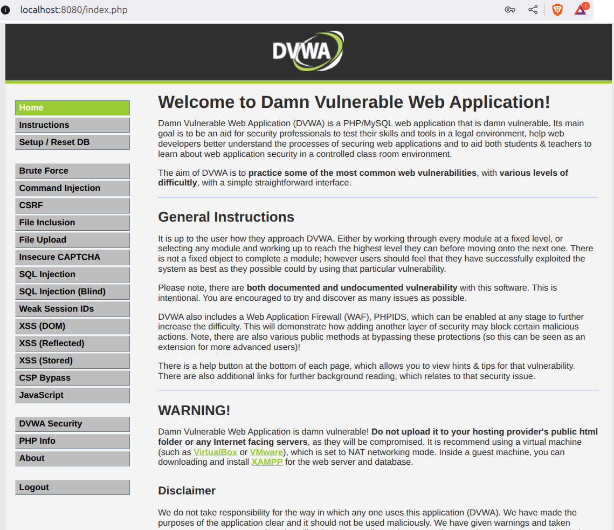

# **Homework: Web Security**

# **Fabián De La Cruz & Roberth Lara**

## **Part 1: Research and Analysis of DDoS Attack Techniques (Unchanged)**

**Objective:** Students will conduct in-depth research on the common methods used to execute Distributed Denial of Service (DDoS) attacks, focusing on the layers of the OSI model they target and how they operate.

* Task A: Categorization and Description  
  Research and define the three primary categories of DDoS attacks (Volumetric, Protocol, Application Layer). For each category, describe its goal and provide at least two specific attack examples. Present your findings in a comparison table.

#### I mean this table seems to be in pretty good shape. I'll do another one nonetheless

| DDoS Category | OSI Layer(s) Targeted | Primary Goal of Attack | Specific Attack Example 1 | Specific Attack Example 2 |
| :---- | :---- | :---- | :---- | :---- |
| **Volumetric** | L3, L4 | Consume all available bandwidth | **UDP Flood** | **DNS Amplification** |
| **Protocol** | L3, L4 | Exhaust server connection state tables | **SYN Flood** | **ICMP Flood** |
| **Application Layer** | L7 | Exhaust application/server resources | **HTTP Flood** | **Slowloris** |

### **Task A Answer**

#### Volumetric Attacks

* Goal: Overwhelm the victim’s bandwidth with massive traffic.

* How it works: Attackers send huge amounts of junk data so the network becomes unusable.

* Examples: UDP Flood, DNS Amplification.

#### Protocol Attacks

* Goal: Exploit protocol weaknesses to drain server resources.

* How it works: Abuses things like TCP handshakes or routing tables.

* Examples: SYN Flood, ICMP Flood.

#### Application Layer Attacks

* Goal: Overload the application itself with resource heavy requests.

* How it works: Sends many legitimate looking requests that force the server to work hard.

* Examples: HTTP Flood, Slowloris.

#### DDoS Attack Categories — Comparison Table
| Category           | OSI Layers | Goal                                  | Examples                                      |
|-------------------|------------|----------------------------------------|------------------------------------------------|
| **Volumetric**     | L3, L4     | Overwhelm bandwidth                    | NTP Amplification, Chargen Flood              |
| **Protocol**       | L3, L4     | Exhaust server protocol handling       | Ping of Death, Smurf Attack                   |
| **Application**    | L7         | Overload application/server resources  | RUDY (R U Dead Yet), Slow POST                |

*   
  Task B: In-Depth Attack Profile  
  Choose one specific attack from your table (e.g., DNS Amplification) and write a detailed profile (250-350 words) that explains its Mechanism, the Resource Exhaustion it causes, and how Botnets/Amplification are used.

### **Task B Answer**

NTP Amplification is a type of Distributed Denial of Service (DDoS) attack that belongs to the volumetric category of network attacks. Its main purpose is to overwhelm a victim’s internet bandwidth by sending extremely large amounts of traffic. The attack abuses the Network Time Protocol (NTP), a service used by servers to keep their clocks synchronized. Some older NTP servers expose a command called “monlist”, which returns a long list of the last devices that interacted with the server. This response is much larger than the request, which makes it useful for attackers who want to increase, or amplify the traffic they can send.

The mechanism is straightforward. The attacker sends a very small NTP request packet to many vulnerable NTP servers, but the key is that the attacker spoofs the source IP address. Instead of using their own address, they fake the victim’s IP. When the NTP servers respond, they send a large “monlist” reply to the victim, not the attacker. Because the response is much bigger than the original request, the attacker creates a large flood of traffic while sending out very little data themselves.

The resource exhaustion occurs at the victim’s network connection. The amplified responses fill up the victim’s bandwidth, causing slowdowns, dropped connections, or complete network outages. Even if the victim’s server hardware or application is strong, it cannot function normally once the internet connection is saturated with unwanted traffic.

Botnets are used to scale the attack. A botnet is a network of compromised computers controlled by the attacker. With hundreds or thousands of infected machines, each one can send spoofed NTP requests to many vulnerable NTP servers. The amplification factor makes the attack even worse because a small amount of traffic from the botnet can generate a massive amount of traffic toward the victim. This combination, botnets plus amplification, allows attackers to overwhelm even large organizations with relatively little effort.

## **Part 2: Hands-On: DVWA Deployment and Common Attacks**

**Objective:** Students will deploy a vulnerable web application using Docker and execute common web attacks in a safe, controlled environment, learning to bypass **basic** security measures.

**⚠️ Ethical Warning:** This task is for **educational, local simulation only**. Students are **strictly forbidden** from attempting these attacks on any public, external, or third-party web resource.

* **Task A: DVWA Installation via Docker**  
  1. Ensure **Docker** is installed and running on your local machine.  
  2. Pull and run the Damn Vulnerable Web Application (DVWA) using a public Docker image (e.g., vulnerables/web-dvwa or citizenstig/dvwa). You will need to map a local port (e.g., port 80\) to the container's web server.  
     **Example Command:** docker run \--rm \-it \-p 80:80 vulnerables/web-dvwa  
  3. Access the DVWA login page at http://localhost/ (or your mapped port). Log in with the default credentials (admin/password) and complete the database setup.  
  4. **Submission:** Provide the exact Docker command(s) you used to pull and run the container, and a screenshot of the DVWA home page.  

### **Task A Process**

* **Task B: Attack Execution and Documentation (Medium Security)**  
  1. Set the DVWA security level to **Medium**. This level often includes functions like mysql\_real\_escape\_string() for SQLi, or basic string replacement for XSS, requiring students to look for weaknesses like lack of case sensitivity or incomplete filtering.  
  2. Successfully execute **three** distinct common web application attacks using the DVWA menu options. Focus on vulnerabilities from the **OWASP Top 10**:  
     * **SQL Injection (SQLi)**: You may need to use **time-based blind techniques** or other bypasses since the standard UNION attack may be sanitized.  
     * **Cross-Site Scripting (XSS)**: You may need to bypass basic input filters by using different encodings, event handlers, or mixed-case tags.  
     * **Command Injection**: Look for ways to bypass filtering of commands like | or & by using other command separators (e.g., &&, ||, or \\n).  
  3. For each of the three attacks, provide:  
     * The **Vulnerability Name** (e.g., SQL Injection).  
     * The **Payload** used (the malicious input string).  
     * A **Screenshot** of the successful exploitation (e.g., the alert box for XSS, or the SQL query result for SQLi).  
     * A **brief explanation** (1-2 sentences) of *why* the attack payload needed to be modified to bypass the Medium security filter.

### **Task B Response**
* **SQL Injection (SQLi)**: 
  * Payload Used: 1 OR 1=1
  * Screenshot:
  
  * Explanation: Medium security in DVWA blocks quotes and common SQL injection characters, making attacks based on strings fail. By using a pure numeric boolean condition like 1 OR 1=1, the filter is bypassed and the SQL query always evaluates to true, causing the application to return all rows instead of a single user.

* **Cross-Site Scripting (XSS)**: 
  * Payload Used: 
  * Screenshot:
  
  * Explanation: On Medium security, DVWA attempts to filter out certain script patterns, but it does not clean all variations of user given HTML/JavaScript. By adjusting the text box to allow a longer payload, we were able to inject a script tag that the application stored and later reflected back to the page, triggering a JavaScript alert.

* **Command Injection**: 
  * Payload Used: 127.0.0.1 | cat /etc/passwd
  * Screenshot:
  
  * Explanation: DVWA Medium does not block the pipe operator ( | ). By appending | cat /etc/passwd after a valid IP, we were able to chain an additional system command, causing the server to execute it and print sensitive system file contents, confirming successful command injection.

---

## **Part 3: Defensive Installation: Web Application Firewall (WAF)** 

**Objective:** Students will install a reverse proxy and WAF solution to understand the defensive mechanisms required to block the attacks performed in Part 2\.

* **Task A: WAF Deployment**  
  1. Research and select an **open-source Web Application Firewall (WAF)** solution that can be run as a reverse proxy, such as **ModSecurity** (often used with Nginx/Apache) or **BunkerWeb** (Docker-friendly).  
  2. Install and configure your chosen WAF to sit **in front of** the running DVWA container.  
  3. Ensure the WAF is configured with a default rule set (e.g., the **OWASP Core Rule Set (CRS)** for ModSecurity, if applicable).  

* **Task B: Defense Testing and Analysis**  
  1. Attempt to execute the **same three attack payloads** from Part 2 *through* the WAF proxy.  
  2. For each payload, document the result: Did the WAF **successfully block** the attack? What **HTTP Status Code** or **Error Message** did the WAF return?  
  3. Locate the WAF's security log and identify the **Rule ID** (if applicable) that triggered the block for at least one of the attacks.  
  4. **Submission:**  
     * The name of the WAF solution installed.  
     * A diagram or detailed explanation of your network setup (WAF $\\rightarrow$ DVWA).  
     * A screenshot of the WAF blocking one of the attack attempts.  
     * An analysis (150-200 words) of the difference between an **Application Layer attack (L7)** you performed (like SQLi) and the **DDoS Application Layer attack** researched in Part 1 (like HTTP Flood).

### **Task B Submission**
* We used the BunkerWeb WAF
* DVWA and BunkerWeb run as separate Docker containers connected through a private virtual network. DVWA is intentionally not exposed to the host machine, so it can only be reached internally through the network. BunkerWeb is the only public-facing service, exposed on port 8080, and acts as a reverse proxy that forwards all traffic to DVWA. Every request from the browser must pass through the WAF first, where BunkerWeb inspects it using security rules before allowing it to reach the vulnerable application.
* 
We attempted to do the SQL injection exactly as we did before. It did not work.

* Application Layer (L7) attacks target how a web application processes requests. In my testing, I performed a SQL Injection attack against the DVWA, which attempts to exploit weaknesses in how user input is handled by the database. This type of attack relies heavily on poor input validation. With a WAF like BunkerWeb in front of DVWA, these malicious patterns are inspected and flagged by rules, meaning the WAF can log or block the SQLi attempt before it reaches the application.

  In contrast, Application Layer DDoS attacks, such as HTTP Floods, do not attempt to exploit logic. Instead, they overwhelm the server by generating a massive amount of seemingly valid HTTP requests. The objective is to exhaust server resources like CPU, memory, or thread capacity. A WAF changes this scenario by acting as a buffer: it rate-limits, filters abnormal traffic patterns, and detects floods before they reach the backend. While SQLi is about exploiting logic and is stopped through signature detection, an L7 DDoS requires the WAF to identify and mitigate high-volume traffic patterns.
 