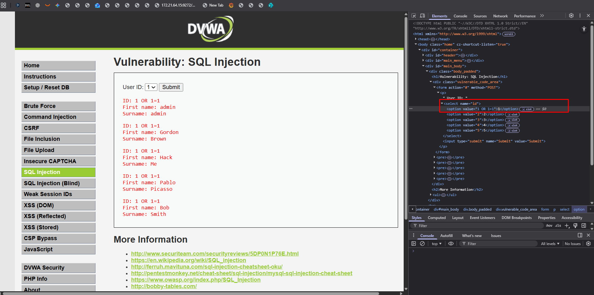
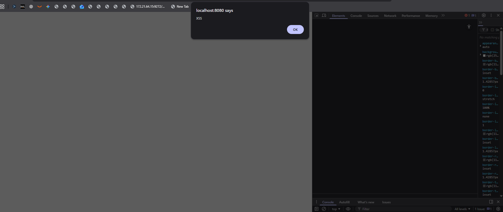
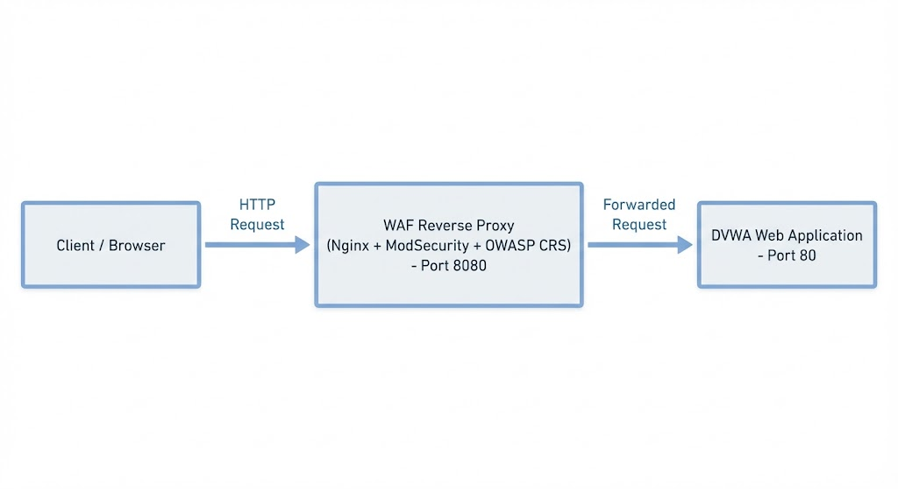
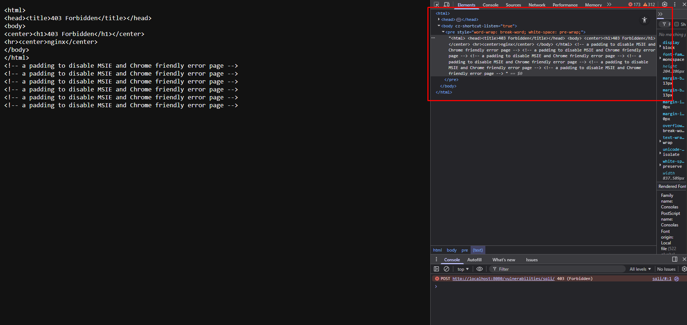
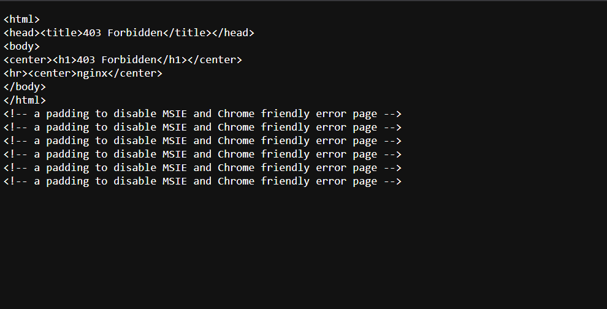

# Homework: Web Security

**Name:** Paulo Cantos 326682

**Course:** CMP 5006 - Information Security (NRC: 3715)

**Institution:** Universidad San Francisco de Quito

## Part 1: Research and Analysis of DDoS Attack Techniques (Unchanged)

**Objective:** Students will conduct in-depth research on the common methods used to execute Distributed Denial of Service (DDoS) attacks, focusing on the layers of the OSI model they target and how they operate.

### Task A: Categorization and Description

Research and define the three primary categories of DDoS attacks (Volumetric, Protocol, Application Layer). For each category, describe its goal and provide at least two specific attack examples. Present your findings in a comparison table.

| DDoS Category | OSI Layer(s) Targeted | Primary Goal of Attack | Specific Attack Example 1 | Specific Attack Example 2 |
| :---- | :---- | :---- | :---- | :---- |
| **Volumetric** | L3, L4 | Consume all available bandwidth | **UDP Flood** | **DNS Amplification** |
| **Protocol** | L3, L4 | Exhaust server connection state tables | **SYN Flood** | **ICMP Flood** |
| **Application Layer** | L7 | Exhaust application/server resources | **HTTP Flood** | **Slowloris** |

### Task B: In-Depth Attack Profile

**Task B Answer: In-Depth Attack Profile**

**Mechanism of the Attack**

A DNS amplification attack is a reflection-based DDoS method that abuses open or poorly configured DNS resolvers operating over UDP port 53. The attacker forges DNS queries with a spoofed source IP so that every request appears to originate from the intended victim. When these queries reach open resolvers, the servers generate legitimate DNS responses and send them directly to the victim's address. To maximize the volume of reflected traffic, attackers craft queries that trigger disproportionately large replies, commonly using ANY requests or DNS records with multiple resource entries. As a result, a small outbound packet from the attacker can yield a response that is dozens of times larger, generating substantial amplification with minimal initial effort.

**Resource Exhaustion**

DNS amplification attacks overwhelm a victim primarily through bandwidth saturation. Because DNS responses can be much larger than the original queries, an attacker can transform a relatively small amount of spoofed traffic into hundreds of megabits or even gigabits per second of inbound data directed at the target. This excessive volume congests upstream routers, firewalls, and transit links, often degrading service before the traffic even reaches the victim's infrastructure. Since UDP is connectionless and does not validate the source address, distinguishing forged traffic from legitimate DNS communication becomes difficult. In many cases, mitigation requires upstream filtering or temporary blackholing of the victim's IP range, effectively causing service disruption even without direct compromise of the target systems.

**Role of Botnets and Amplification**

Botnets significantly enhance the scale and persistence of DNS amplification attacks. A distributed network of compromised machines can generate spoofed requests from numerous autonomous systems, making it harder for defenders to identify a single source or apply uniform filtering. Many infected devices, especially IoT hardware, operate in networks without strict egress filtering, allowing widespread source IP spoofing. By combining a large pool of bots with thousands of open resolvers, attackers achieve massive reflection and amplification. The botnet does not rely on high individual bandwidth; rather, its effectiveness comes from the collective impact of many small spoofed queries that each trigger amplified responses. This synergy makes DNS amplification a consistently effective vector for large-scale DDoS operations.

## Part 2: Hands-On: DVWA Deployment and Common Attacks

**Objective:** Students will deploy a vulnerable web application using Docker and execute common web attacks in a safe, controlled environment, learning to bypass **basic** security measures.

**Ethical Warning:** This task is for **educational, local simulation only**. Students are **strictly forbidden** from attempting these attacks on any public, external, or third-party web resource.

### Task A: DVWA Installation via Docker

1. Ensure **Docker** is installed and running on your local machine.  
2. Pull and run the Damn Vulnerable Web Application (DVWA) using a public Docker image (e.g., vulnerables/web-dvwa or citizenstig/dvwa). You will need to map a local port (e.g., port 80) to the container's web server.  
   **Example Command:** docker run --rm -it -p 80:80 vulnerables/web-dvwa  
3. Access the DVWA login page at http://localhost/ (or your mapped port). Log in with the default credentials (admin/password) and complete the database setup.  
4. **Submission:** Provide the exact Docker command(s) you used to pull and run the container, and a screenshot of the DVWA home page.  

### Task B: Attack Execution and Documentation (Medium Security)

1. Set the DVWA security level to **Medium**. This level often includes functions like mysql_real_escape_string() for SQLi, or basic string replacement for XSS, requiring students to look for weaknesses like lack of case sensitivity or incomplete filtering.  
2. Successfully execute **three** distinct common web application attacks using the DVWA menu options. Focus on vulnerabilities from the **OWASP Top 10**:  
   * **SQL Injection (SQLi)**: You may need to use **time-based blind techniques** or other bypasses since the standard UNION attack may be sanitized.  
   * **Cross-Site Scripting (XSS)**: You may need to bypass basic input filters by using different encodings, event handlers, or mixed-case tags.  
   * **Command Injection**: Look for ways to bypass filtering of commands like | or & by using other command separators (e.g., &&, ||, or \n).  
3. For each of the three attacks, provide:  
   * The **Vulnerability Name** (e.g., SQL Injection).  
   * The **Payload** used (the malicious input string).  
   * A **Screenshot** of the successful exploitation (e.g., the alert box for XSS, or the SQL query result for SQLi).  
   * A **brief explanation** (1-2 sentences) of *why* the attack payload needed to be modified to bypass the Medium security filter.

---

### Attack Execution - DVWA (Security Level: Medium)

### Attack 1 - SQL Injection (Medium)

**Vulnerability Name:** SQL Injection (Authentication Bypass via manipulated parameter)

**Payload Used:**

```
1 OR 1=1

```

**Screenshot:**  

<p align="center">
  
</p>

**Explanation (Why it bypasses Medium):**  
DVWA Medium restricts input with a visual <select>, but it does not validate the value on the backend, so an attacker can modify the HTML and submit an arbitrary parameter such as 1 OR 1=1. The server executes the query without prepared statements, allowing all rows in the table to be extracted.

### Attack 2 - Reflected XSS (Medium)

**Vulnerability Name:** Reflected Cross-Site Scripting (XSS)

**Payload Used:**

```


```

**Screenshot:**  

<p align="center">
  
</p>

**Explanation (Why it bypasses Medium):**  
The Medium filter removes <script> but does not block new HTML tags with events, such as an  with onerror. When the image fails to load, the browser executes alert('XSS'), achieving the injection despite partial sanitization.

### Attack 3 - Command Injection (Medium)

**Vulnerability Name:** Command Injection (OS Command Execution)

**Payload Used:**

```
127.0.0.1 | ls -laR /var/www/html

```

**Screenshot:**  

<p align="center">
  
</p>

**Explanation (Why it bypasses Medium):**  
DVWA Medium replaces dangerous operators (|, ;, &&, ||) with spaces, but the Linux shell interprets the space as a command separator, executing the ls -laR after the ping. This allows arbitrary commands to run and returns full system listings.

## Part 3: Defensive Installation: Web Application Firewall (WAF)

**Objective:** Students will install a reverse proxy and WAF solution to understand the defensive mechanisms required to block the attacks performed in Part 2.

### Task A: WAF Deployment

1. Research and select an **open-source Web Application Firewall (WAF)** solution that can be run as a reverse proxy, such as **ModSecurity** (often used with Nginx/Apache) or **BunkerWeb** (Docker-friendly).  
2. Install and configure your chosen WAF to sit **in front of** the running DVWA container.  
3. Ensure the WAF is configured with a default rule set (e.g., the **OWASP Core Rule Set (CRS)** for ModSecurity, if applicable).  

### Task B: Defense Testing and Analysis

1. Attempt to execute the **same three attack payloads** from Part 2 *through* the WAF proxy.  
2. For each payload, document the result: Did the WAF **successfully block** the attack? What **HTTP Status Code** or **Error Message** did the WAF return?  
3. Locate the WAF's security log and identify the **Rule ID** (if applicable) that triggered the block for at least one of the attacks.  
4. **Submission:**  
   * The name of the WAF solution installed.  
   * A diagram or detailed explanation of your network setup (WAF -> DVWA).  
   * A screenshot of the WAF blocking one of the attack attempts.  
   * An analysis (150-200 words) of the difference between an **Application Layer attack (L7)** you performed (like SQLi) and the **DDoS Application Layer attack** researched in Part 1 (like HTTP Flood).

### WAF Installed

Web Application Firewall:  
ModSecurity with the OWASP Core Rule Set (CRS) running on Nginx (Docker).

Architecture:  
Client -> Nginx (ModSecurity + OWASP CRS) -> DVWA

Diagram:  

<p align="center">
  
</p>

The WAF listens on port 8080, inspects each incoming request using CRS detection rules, and only forwards requests to DVWA when no security violations are detected.

### Attack Attempts Through the WAF

The three previously successful attacks (SQL Injection, XSS, and Command Injection) were re-executed, but this time through the WAF, accessing DVWA exclusively via:

http://localhost:8080

In all three cases, ModSecurity intercepted the malicious payloads and returned HTTP 403 Forbidden, effectively preventing DVWA from processing any harmful input.

### Attack 1 - SQL Injection (Blocked)

**Payload Attempted:**

```
1 OR 1=1

```

**Result:**  
The WAF immediately returned HTTP 403 Forbidden (sqli_waf.png), blocking the request before it reached DVWA.

**Reason for Block:**  
OWASP CRS includes SQL Injection detection rules from the 9421XX rule family, which identify logical operators such as OR 1=1 as classical SQLi patterns. The rule triggered and the request was denied.

**Screenshot:**  

<p align="center">
  
</p>

### Attack 2 - Reflected XSS (Blocked)

**Payload Attempted:**

```


```

**Result:**  
The WAF responded with HTTP 403 Forbidden (xss_waf.png). The JavaScript payload never executed in the browser.

**Reason for Block:**  
CRS rules from the 9411XX family detect client-side script injections, including event-handler attributes like onerror=. The WAF flagged the request as an XSS attempt and blocked it.

**Screenshot:**  

<p align="center">
  
</p>

### Attack 3 - Command Injection (Blocked)

**Payload Attempted:**

```
127.0.0.1 | ls -laR /var/www/html

```

**Result:**  
The WAF blocked the request, returning HTTP 403 Forbidden (cmdinj_waf.png). No operating system command was executed.

**Reason for Block:**  
ModSecurity identified the pipe operator (|) and command-injection patterns associated with the 9321XX rule set, classifying the request as an OS Command Injection attempt and preventing execution.

**Screenshot:**  

<p align="center">
  
</p>

### Summary of Findings

The WAF successfully demonstrated its effectiveness by detecting and blocking:

SQL Injection

Reflected XSS

OS Command Injection

All three attacks were fully successful without the WAF, but once routed through ModSecurity + OWASP CRS, each malicious request was intercepted and denied with HTTP 403 Forbidden.

This confirms the successful deployment of a reverse-proxy WAF and meets all requirements of Part 3B.


