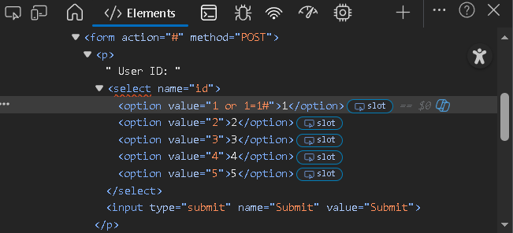
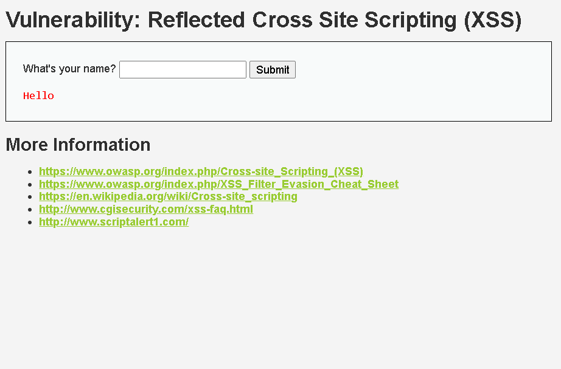
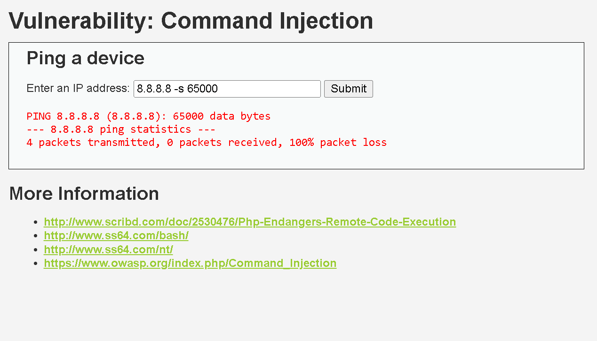

# Homework 3 – Web Security  
**Xavier Sebastián Tandazo Cobo — 2025**

---

# 1. Task A: Categorization and Description

Según Stallings (Cap. 21), los ataques **DDoS** buscan agotar recursos de la víctima. Se clasifican en tres grandes categorías:

---

## 1.1 Volumetric Attacks  
Saturan el **ancho de banda** de la red objetivo impidiendo que el tráfico legítimo pueda llegar.  
**Ejemplos:**
- **UDP Flood**
- **Smurf Attack**

---

## 1.2 Protocol-Based Attacks  
No saturan la red, sino **recursos internos del host**, como tablas TCP o buffers.  
**Ejemplos:**
- **SYN Flood**
- **Ping of Death**

---

## 1.3 Application Layer Attacks (L7)  
Parecen tráfico legítimo pero consumen **hilos HTTP, CPU o consultas a BD**.  
**Ejemplos:**
- **HTTP GET/POST Flood**
- **Slowloris**

---

## 1.4 Resumen comparativo

| Categoría | Capa OSI | Objetivo | Ejemplo 1 | Ejemplo 2 |
|----------|----------|----------|-----------|-----------|
| Volumétricos | L3–L4 | Saturar el enlace de red | UDP Flood | Smurf |
| Basados en protocolo | L3–L4 | Agotar recursos internos (TCP, buffers) | SYN Flood | Ping of Death |
| Capa de aplicación | L7 | Consumir recursos lógicos | HTTP Flood | Slowloris |

---

# 2. Task B: In‑Depth Attack Profile — HTTP Flood

El **HTTP Flood** es un ataque L7 donde miles de solicitudes HTTP válidas saturan los recursos de la aplicación sin usar mucho ancho de banda.

### Mecanismo
- El atacante envía múltiples **GET/POST** hacia endpoints costosos.
- El tráfico es válido según el protocolo.
- No depende de paquetes grandes, sino del **costo computacional** de responder.

### Agotamiento de recursos
- Se saturan hilos del servidor, CPU y consultas a BD.
- El servidor sigue "arriba", pero no atiende usuarios reales.

### Botnets y “amplificación”
- Botnets distribuyen las solicitudes entre miles de hosts.
- No hay amplificación de red, pero sí **amplificación lógica**:  
  una sola solicitud puede generar operaciones costosas.

---

# 3. Task A (DVWA): Installation via Docker

DVWA se desplegó localmente con Docker usando el comando:

docker run --rm -it -p 80:80 vulnerables/web-dvwa

Al ingresar a http://localhost/, se configuró el nivel de seguridad en **Medium**.

---

# 4. Task B: Execution of the Attack in DVWA

## 4.1 SQL Injection (Medium Security)

En Medium, DVWA:
- Escapa comillas (`mysql_real_escape_string`)
- Reemplaza el input por un menú (1–5)
- Bloquea payloads con `'`

**Request capturada en Network:**

**Payload fallido (con comillas):**

id=1' or 1=1#

**Payload exitoso (sin comillas):**

id=1 or 1=1#

El backend no usa comillas en la consulta, por eso el payload funciona.

### Bypass modificando el HTML

Se editó el `<option>` del formulario:

<option value="1 or 1=1#">1</option>

Al enviar el formulario, se obtuvo nuevamente la inyección exitosa:

---

## 4.2 Cross-Site Scripting (Reflected XSS) — Medium

DVWA Medium filtra solo la cadena literal `

Es filtrado y mostrado como texto:

El filtro es débil: solo revisa texto plano.  
El navegador sí reconstruye HTML aunque llegue fragmentado.

**Payload usado:**

<scr<script>ipt>alert('XSS')</scr<script>ipt>

La alerta se ejecuta antes del renderizado, y la página luego muestra solo “Hello”:

---

## 5. Command Injection — Medium Security

DVWA Medium usa `escapeshellcmd`, bloqueando operadores peligrosos: `; | &`  
Sin embargo, **no valida los argumentos** del comando permitido (`ping`).

**Payload usado:**

8.8.8.8 -s 65000

`-s 65000` crea un paquete ICMP muy grande → retardo notable, efecto tipo DoS.

También se observó un bypass adicional usando `&` con comillas:

8.8.8.8 & echo "Te voy a Hackear"

Este comando sí se ejecutó:

# 6. Task C: Defensive Installation: WAF (ModSecurity + Nginx)

### Montaje de contenedores
- **DVWA:** aplicación vulnerable
- **MariaDB:** base de datos
- **Nginx + ModSecurity:** WAF como reverse proxy con reglas CRS

Todo el tráfico HTTP pasa a través del WAF. Primero en modo DetectionOnly, luego Enforce.

### Diagrama de red

Usuario / Navegador → Nginx + ModSecurity (WAF) → DVWA → MariaDB

---

### Pruebas de defensa

- **SQL Injection:** payload id=1 OR 1=1# bloqueado con HTTP 403.
  
- **XSS:** payloads con `<script>` neutralizados.
- **Command Injection:** operadores peligrosos bloqueados; argumentos permitidos no interceptados.
- **HTTP Flood simulado:** rate-limiting reduce parcialmente el impacto.

### Conclusiones

- WAF efectivo frente a ataques L7 (SQLi, XSS) pero no detiene HTTP Flood distribuido.
- Combinación de WAF + validación de backend + monitoreo de tráfico es clave para defensa integral.
